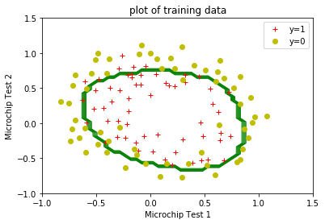
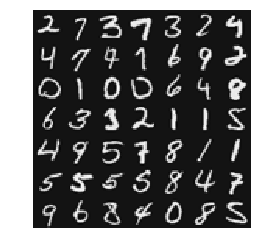

# Logistic Regression
## Sigmoid Function And Cost Function
### Sigmoid Function

```python
import numpy as np
import math
x = np.linspace(-10,10);
y = 1 / (1+np.exp(-x));
from matplotlib import pyplot as plt
plt.plot(x,y,'-');
plt.title('Sigmoid function/Logistic function - Logistic Regression');
plt.show();
```


### Cost Function

```python
x = np.linspace(0.001,0.999,1000);
y = -np.log(x);
yy = -np.log(1-x);
plt.plot(x,y,x,yy,'r-');
plt.legend(["y=1","y=0"]);
plt.title('cost function - Logistic Regression')
plt.show();
```


## Logistic Regression
build a classification model that estimates an applicant's probability of admission based on the scores from those two exams.

### 读取数据

```python
import pandas as pd
data = pd.read_csv('ex2data1.csv');
data.head()
```

### 数据可视化

提取正反数据集。

```python
positive_train_examples = data[data['admission'] == 1];
negative_train_examples = data[data['admission'] == 0];
```

定义绘制正反数据的辅助函数。

```python
def plotData( x1,y1,x2,y2,
				xlabel='x',
				ylabel='y',
				title='title',
				lengend=['y=1','y=0'] ):
    plt.plot(x1,y1,'r+');
    plt.plot(x2,y2,'yo');
    plt.xlabel(xlabel);
    plt.ylabel(ylabel);
    plt.title(title);
    plt.legend(lengend,loc=1);
    plt.show();
```

绘制正反数据图像。

```python
plotData( positive_train_examples['score1'],
			positive_train_examples['score2'],
			negative_train_examples['score1'],
			negative_train_examples['score2'],
        	xlabel='Exam 1 score', 
			ylabel='Exam 2 score',
        	title="plot of train data" );
```


### The Big Picture of Logistic Regression

用sklearn库中的线性模型 LogisticRegression 来训练数据，得到假设函数的参数Theta。模型的准确率可以用score函数求得。而predict可以用来预测数据所属的类别，其中predict_proba可以显示概述所属类别的概率。
```python
# https://scikit-learn.org/stable/modules/linear_model.html#logistic-regression
from sklearn.linear_model import LogisticRegression
X = data.as_matrix(['score1','score2']);
y = data['admission'];

linear_model = LogisticRegression(solver='lbfgs')
clf = linear_model.fit(X,y);
print(clf.coef_,clf.intercept_);
# out: [[0.20535491 0.2005838 ]] [-25.05219314]

clf.score(X,y)
# out: 0.89

test = [[45, 85]];
clf.predict_proba(test)
```


   
```python
x1 = np.linspace(30,100,100);
x2 = -(clf.intercept_ + clf.coef_[0][0] * x1)/clf.coef_[0][1];
plt.plot(x1,x2,'b-');

plotData( positive_train_examples['score1'],
			positive_train_examples['score2'],
         	negative_train_examples['score1'],
			negative_train_examples['score2'],
        	xlabel='Exam 1 score', 
			ylabel='Exam 2 score',
        	title="plot of train data");
```


## Regularized logistic regression
Task: predict whether microchips from a fabrication plant
passes quality assurance(QA).

```python
import pandas as pd
train_examples = pd.read_csv('ex2data2.csv');
positive_train_examples = 
	train_examples[train_examples['qa']==1];
negative_train_examples = 
	train_examples[train_examples['qa']==0];
```

### 数据可视化

```python
plotData(positive_train_examples['test1'],
         positive_train_examples['test2'],
         negative_train_examples['test1'],
         negative_train_examples['test2'],
         xlabel='Microchip Test 1',
         ylabel='Microchip Test 2',
         title='plot of training data');
```


```python
def mapFeatures(x1,x2):
    degree=6
    index = 0
    out = np.zeros((x1.size,27));
    out
    for i in range(1,degree+1):
        for j in range(0,i+1):
            out[:,index] = (x2 ** j) * (x1 **(i-j));
            index = index+1;
    return out

x1 = np.array([2]);
x2 = np.array([3]);
mapFeatures(x1,x2)
```


>    out: array([[  2.,   3.,   4.,   6.,   9.,   8.,  12.,  18.,  27.,  16.,  24.,  
             36.,  54.,  81.,  32.,  48.,  72., 108., 162., 243.,  64.,  96.,
            144., 216., 324., 486., 729.]])

```python
new_X = mapFeatures(X[:,0],X[:,1]);
new_y = y;
```


```python
clf = linear_model.fit(new_X,new_y);
clf.score(new_X,new_y)
```

>  out: 0.8305084745762712  

```python
print(clf.intercept_,clf.coef_);
```

> out:   
>  1.27271075  
>  0.62536719  
> 1.18095854   
> -2.01961804   
> -0.91752388   
> -1.43170395    
> 0.12391867   
> -0.36536954   
> -0.35715555   
> -0.17501434   
> -1.45827831   
> -0.05112356   
> -0.61575808  
> -0.27472128   
> -1.19276292   
> -0.24241519   
> -0.20587922   
> -0.0448395    
> -0.27780311   
> -0.29535733   
> -0.45625452   
> -1.04347339    
> 0.02770608   
> -0.29252353    
> 0.01550105  
>  -0.32746466   
> -0.1439423    
> -0.92460358]  

```python
def plotDecisionBoundary(clf):
    u = np.linspace(-1,1.5,50);
    v = np.linspace(-1,1.5,50);

    U,V = np.meshgrid(u,v);
    Z = np.zeros((len(u),len(v)));
    for i in range(0,len(u)):
        for j in range(0,len(v)):
            test = mapFeatures(np.array(u[i]),np.array(v[j]));
            Z[i,j] = clf.predict(test);
    
    plt.contour(U,V,Z,colors='g', linewidths=1);
    plt.legend(['boundary']);
    
    plotData(positive_train_examples['test1'],
         positive_train_examples['test2'],
         negative_train_examples['test1'],
         negative_train_examples['test2'],
         xlabel='Microchip Test 1',
         ylabel='Microchip Test 2',
         title='plot of training data');
    
plotDecisionBoundary(clf);
```


## Multi-class logistic Regression
### extract training data into csv format
```octave
load('ex3data1.mat')
m = [X, y];
csvwrite('handwritten_digits.csv',m);
```

### read training data

```python
import pandas as pd
train_data  = pd.read_csv('handwritten_digits.csv',header=None)
train_data.head()
```

### preprocess training data into X, y

```python
import numpy as np
index = list(range(0,400))
X = train_data.as_matrix(index);
y = train_data[400];
```

### visualize training data in graphic mode

```python
from matplotlib import pyplot as plt
def displayData(X,row=None,col=None):
    m,n=X.shape
    w = h = int(np.sqrt(n))
    if row==None or col == None:
        row = col = int(np.sqrt(m))
    data = []
    index = 0
    for r in range(0,row):
        rows = []
        for c in range(0,col):
            rows.append(np.reshape(X[index,:],(w,h),order='F'))
            index = index + 1
        data.append(rows)
    
    rows = []
    for r in range(0,row):
        t = np.concatenate(tuple(data[r]),axis=1);
        rows.append(t);
    
    c = np.concatenate(tuple(rows));
    plt.imshow(c,cmap="gray")
    plt.axis('off')
    plt.show();
        
m,n=X.shape
rand_indice = np.random.permutation(m)
displayData(X[rand_indice[:49]]);

```

### train the model
```python
from sklearn.linear_model import LogisticRegression
linear_model = LogisticRegression(solver='lbfgs')
clf = linear_model.fit(X,y);
print("Training Set Accuracy: ",clf.score(X,y))
```

> Training Set Accuracy:  0.9446  

### predict train data

```python
m,n=X.shape
rand_indice = np.random.permutation(m)
row=4
col=3
test_train = X[rand_indice[:row*col]]
displayData(test_train,row,col)
print(np.reshape(clf.predict(test_train),(row,col)))
```


>  [	  
> 	[ 4   	4  6]  
> 	[10  6  4]  
> 	[ 6  	6  5]  
> 	[ 5  	2  8]  
> ]  

### References
* [octave - Export cell array to multi-column csv file - Stack Overflow](https://stackoverflow.com/questions/14378996/export-cell-array-to-multi-column-csv-file)
