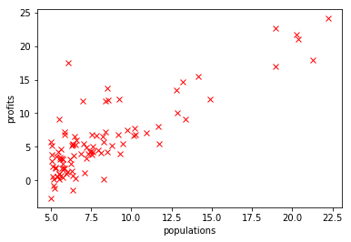

# 机器学习笔记

## 用pandas读入数据

```python
import pandas as pd
data = pd.read_csv('populations_profits.csv')
data.head()

populations	profits
0	6.1101	17.5920
1	5.5277	9.1302
2	8.5186	13.6620
3	7.0032	11.8540
4	5.8598	6.8233
```

## 构建训练的数据变量

```python
x = data.as_matrix(['populations']);
y = data.as_matrix(['profits']);
```

## 绘制数据的散列图

```text
from matplotlib import pyplot as plt
plt.plot(x,y,'rx');
plt.xlabel('populations');
plt.ylabel('profits');
```



## 用sklearn的线性模型学习

```python
from sklearn import linear_model
reg = linear_model.LinearRegression();
reg.fit(x,y);
print('intercept: ', reg.intercept_);
print('coef: ', reg.coef_);

# output
# coef:  [[1.19303364]]
# intercept:  [-3.89578088]
```

## 预测

```text
from sklearn.metrics import mean_squared_error
y_predict = reg.predict(x);
plt.plot(x,y,'rx',x,y_predict,'-');
mean_squared_error(y,y_predict)/2;

# output
# 4.476
```


