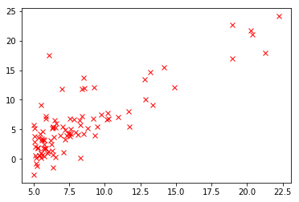

```python
## 吴恩达的机器学习课程第二周的程序设计作业：线性回归
# https://www.coursera.org/learn/machine-learning/programming/8f3qT/linear-regression
```


```python
import pandas as pd

data = pd.read_csv('populations_profits.csv');
data.head()
```


<div>
<style scoped>
    .dataframe tbody tr th:only-of-type {
        vertical-align: middle;
    }

    .dataframe tbody tr th {
        vertical-align: top;
    }

    .dataframe thead th {
        text-align: right;
    }
</style>
<table border="1" class="dataframe">
  <thead>
    <tr style="text-align: right;">
      <th></th>
      <th>populations</th>
      <th>profits</th>
    </tr>
  </thead>
  <tbody>
    <tr>
      <th>0</th>
      <td>6.1101</td>
      <td>17.5920</td>
    </tr>
    <tr>
      <th>1</th>
      <td>5.5277</td>
      <td>9.1302</td>
    </tr>
    <tr>
      <th>2</th>
      <td>8.5186</td>
      <td>13.6620</td>
    </tr>
    <tr>
      <th>3</th>
      <td>7.0032</td>
      <td>11.8540</td>
    </tr>
    <tr>
      <th>4</th>
      <td>5.8598</td>
      <td>6.8233</td>
    </tr>
  </tbody>
</table>
</div>


```python
import numpy as np
x = data.as_matrix(['populations']);
y = data.as_matrix(['profits']);
```


```python
from matplotlib import pyplot as plt

plt.plot(x,y,'rx');
plt.show();
```





```python
from sklearn import linear_model

reg = linear_model.LinearRegression();
reg.fit(x,y);

print('coef: ', reg.coef_)
print('intercept: ', reg.intercept_)
```

    coef:  [[1.19303364]]
    intercept:  [-3.89578088]


```python
ypredict = reg.predict(x)

plt.plot( x, y,'rx', x, ypredict, '-');
plt.show();
```


```python
from sklearn.metrics import mean_squared_error
mean_squared_error(y,ypredict)/2
```


    4.476971375975179


