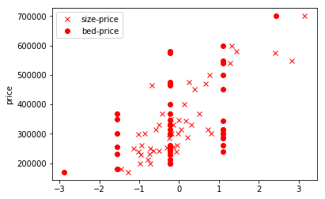

```python
import pandas as pd
data = pd.read_csv('size_bed_price.csv');
data.head()
```


<div>
<style scoped>
    .dataframe tbody tr th:only-of-type {
        vertical-align: middle;
    }

    .dataframe tbody tr th {
        vertical-align: top;
    }

    .dataframe thead th {
        text-align: right;
    }
</style>
<table border="1" class="dataframe">
  <thead>
    <tr style="text-align: right;">
      <th></th>
      <th>size</th>
      <th>bed</th>
      <th>price</th>
    </tr>
  </thead>
  <tbody>
    <tr>
      <th>0</th>
      <td>2104</td>
      <td>3</td>
      <td>399900</td>
    </tr>
    <tr>
      <th>1</th>
      <td>1600</td>
      <td>3</td>
      <td>329900</td>
    </tr>
    <tr>
      <th>2</th>
      <td>2400</td>
      <td>3</td>
      <td>369000</td>
    </tr>
    <tr>
      <th>3</th>
      <td>1416</td>
      <td>2</td>
      <td>232000</td>
    </tr>
    <tr>
      <th>4</th>
      <td>3000</td>
      <td>4</td>
      <td>539900</td>
    </tr>
  </tbody>
</table>
</div>


```python
data.describe()
data.mean()['size']
```


    2000.6808510638298


```python
x = data.as_matrix(['size','bed']);
y = data.as_matrix(['price']);
```


```python
from matplotlib import pyplot as plt
plt.figure(1);
plt.subplot(121);
plt.plot(x[:,0], y, 'rx');
plt.xlabel('size in feet');
plt.ylabel('price');
plt.subplot(122);
plt.plot(x[:,1], y, 'ro');
plt.xlabel('beds');
plt.ylabel('price');
plt.show();
```


```python
from sklearn import preprocessing
x = preprocessing.scale(x);
plt.plot(x[:,0],y,'rx',x[:,1],y,'ro');
plt.ylabel('price');
plt.legend(['size-price','bed-price']);
plt.show();
```





```python
plt.plot(x[:,0],x[:,1],'rx');
plt.xlabel('size');
plt.ylabel('bed');
plt.show();
```


```python
from sklearn import linear_model
reg = linear_model.LinearRegression();
reg.fit(x,y);
print('intercept: ', reg.intercept_);
print('coef: ', reg.coef_);
```

    intercept:  [340412.65957447]
    coef:  [[109447.79646964  -6578.35485416]]


```python
s = (1650 - data.mean()['size'])/data.std()['size'];
b = (3 - data.mean()['bed'])/data.std()['bed'];
x_test = [[ s, b]];
print('xx = ', x_test);
ypredict = reg.predict(x_test);
print('a 1650 sq-ft, 3 br house:', ypredict)

```

    xx =  [[-0.4412732005944351, -0.2236751871685913]]
    a 1650 sq-ft, 3 br house: [[293587.69488157]]

