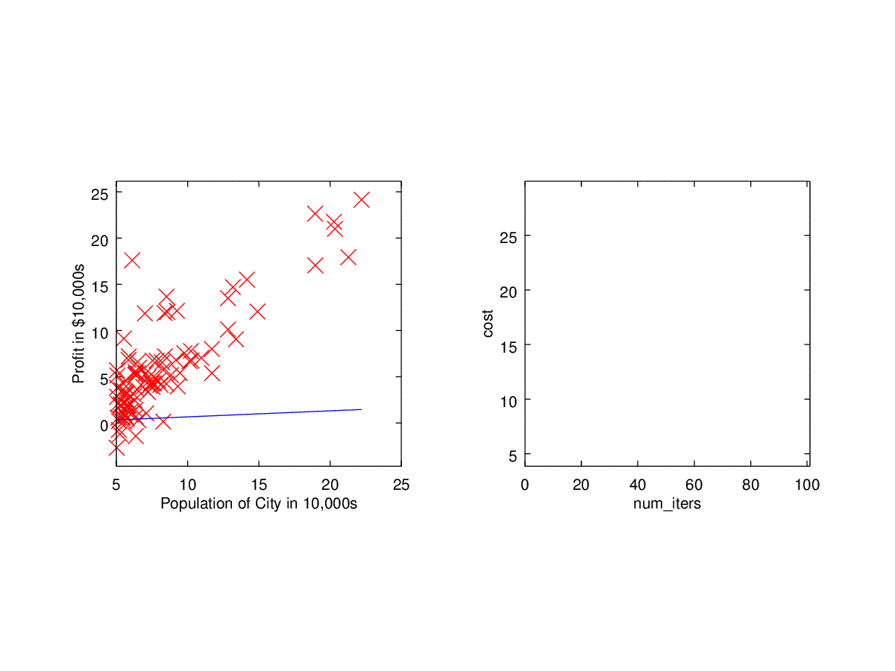

# 线性回归
## 单变量线性回归程序设计作业 - python

```python
## 吴恩达的机器学习课程第二周的程序设计作业：线性回归
# https://www.coursera.org/learn/machine-learning/programming/8f3qT/linear-regression
```

### 读取数据

```python
import pandas as pd

data = pd.read_csv('populations_profits.csv');
data.head()
```

### 获取训练数据 X, y

```python
import numpy as np
x = data.as_matrix(['populations']);
y = data.as_matrix(['profits']);
```

### 数据可视化

```python
from matplotlib import pyplot as plt

plt.plot(x,y,'rx');
plt.show();
```


### 训练 Linear Regression 模型

```python
from sklearn import linear_model

reg = linear_model.LinearRegression();
reg.fit(x,y);

print('coef: ', reg.coef_)
print('intercept: ', reg.intercept_)
```

    coef:  [[1.19303364]]
    intercept:  [-3.89578088]

### 训练模型可视化

```python
ypredict = reg.predict(x)

plt.plot( x, y,'rx', x, ypredict, '-');
plt.show();
```


### 训练模型的误差

```python
from sklearn.metrics import mean_squared_error
mean_squared_error(y,ypredict)/2
```

>  4.476971375975179  

## 多变量线性回归程序设计作业 - python
### 读取 大小-床数-价格 数据

```python
import pandas as pd
data = pd.read_csv('size_bed_price.csv');
data.head()
```

### 数据的一些信息显示

```python
data.describe()
data.mean()['size']
```

>    2000.6808510638298  

### 获取训练数据 X, y

```python
x = data.as_matrix(['size','bed']);
y = data.as_matrix(['price']);
```

### 训练数据的可视化

```python
from matplotlib import pyplot as plt
plt.figure(1);
plt.subplot(121);
plt.plot(x[:,0], y, 'rx');
plt.xlabel('size in feet');
plt.ylabel('price');
plt.subplot(122);
plt.plot(x[:,1], y, 'ro');
plt.xlabel('beds');
plt.ylabel('price');
plt.show();
```


### Feature Scaling

```python
from sklearn import preprocessing
x = preprocessing.scale(x);
plt.plot(x[:,0],y,'rx',x[:,1],y,'ro');
plt.ylabel('price');
plt.legend(['size-price','bed-price']);
plt.show();
```


### 大小-床数 关系图形表示

```python
plt.plot(x[:,0],x[:,1],'rx');
plt.xlabel('size');
plt.ylabel('bed');
plt.show();
```


### 训练模型

```python
from sklearn import linear_model
reg = linear_model.LinearRegression();
reg.fit(x,y);
print('intercept: ', reg.intercept_);
print('coef: ', reg.coef_);
```

>    intercept:  [340412.65957447]  
>    coef:  [[109447.79646964  -6578.35485416]]  

### 对大小为 1650, 床数为 3 的房子价格的预测

```python
s = (1650 - data.mean()['size'])/data.std()['size'];
b = (3 - data.mean()['bed'])/data.std()['bed'];
x_test = [[ s, b]];
print('xx = ', x_test);
ypredict = reg.predict(x_test);
print('a 1650 sq-ft, 3 br house:', ypredict)

```

> xx =  [[-0.4412732005944351, -0.2236751871685913]]
> a 1650 sq-ft, 3 br house: [[293587.69488157]]

### GradientDescent过程




